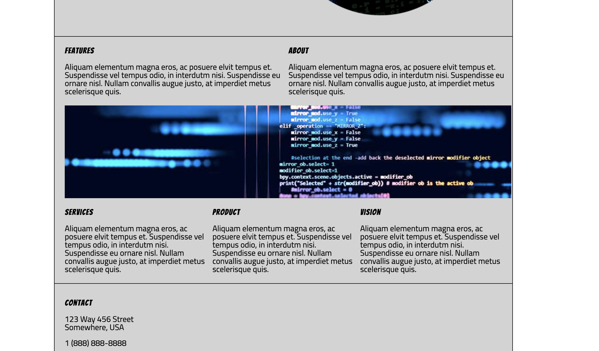
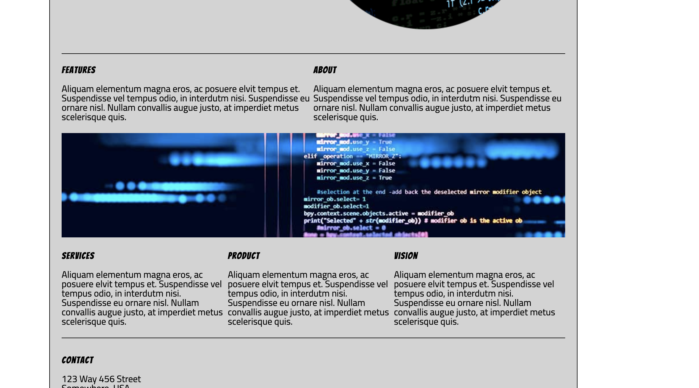

You have a super solid project here. I love how you incorporated your images as background-images in your css - they become super easy to work with that way! 

What I am going to say here is suppppper nitpicky but it has to do with the middle area of the project. 

Do you see how the middle area seems ever so slightly askew? You have some padding there on the left section content that's pushing the content away from the border of the page. I tweaked the code slightly and came up with this....a little better...I would probably do something with the horizontal lines so that they go all the way across instead of be constrained by the padding. I didn't see horizontal lines in your html code so I assume you are using borders.

Very solid project. Well done. Love the animations! Keep that up!